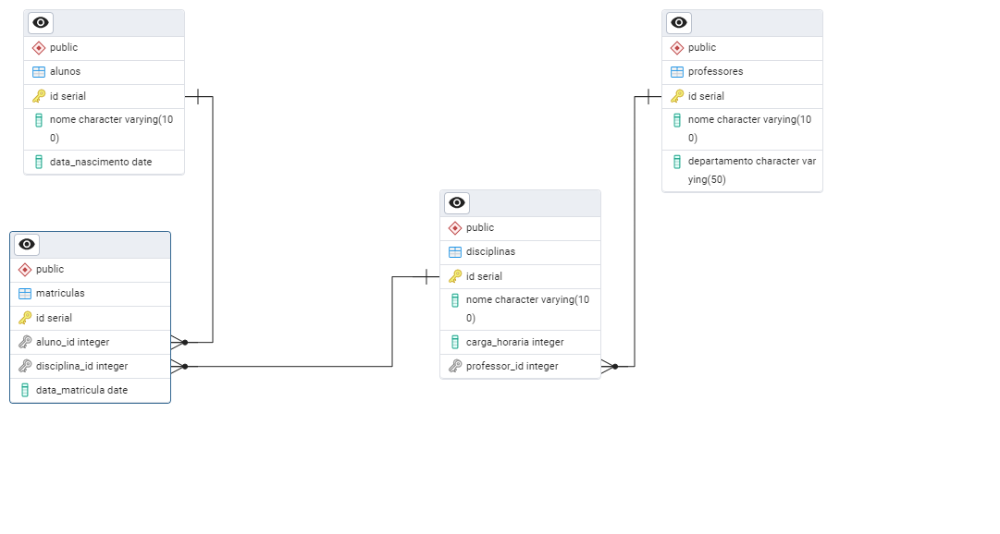

# 📚 Sistema de Gerenciamento Escolar

Projeto acadêmico desenvolvido para praticar conceitos de modelagem de banco de dados relacional utilizando SQL e PostgreSQL.

O sistema representa um cenário de gerenciamento escolar, permitindo o cadastro de professores, alunos, disciplinas e matrículas, além de estabelecer os relacionamentos entre essas entidades através de chaves primárias e estrangeiras.

---

## 📌 Objetivo

Este projeto foi desenvolvido com o objetivo de aplicar conceitos fundamentais de Banco de Dados, como:

- Modelagem Entidade-Relacionamento (MER)
- Criação de tabelas
- Definição de chaves primárias (Primary Keys)
- Definição de chaves estrangeiras (Foreign Keys)
- Integridade referencial
- Inserção de dados para testes

---

## 🛠️ Tecnologias Utilizadas

- PostgreSQL
- SQL

---

## 🗂️ Estrutura do Banco

O banco é composto por quatro tabelas principais:

### 👨‍🎓 Alunos

Armazena as informações dos alunos cadastrados.

| Campo | Tipo |
|--------|------|
| id | SERIAL |
| nome | VARCHAR(100) |
| data_nascimento | DATE |

---

### 👨‍🏫 Professores

Armazena os professores responsáveis pelas disciplinas.

| Campo | Tipo |
|--------|------|
| id | SERIAL |
| nome | VARCHAR(100) |
| departamento | VARCHAR(50) |

---

### 📖 Disciplinas

Representa as disciplinas oferecidas pela instituição.

Cada disciplina possui um professor responsável.

| Campo | Tipo |
|--------|------|
| id | SERIAL |
| nome | VARCHAR(100) |
| carga_horaria | INT |
| professor_id | INT |

---

### 📝 Matrículas

Relaciona alunos às disciplinas.

| Campo | Tipo |
|--------|------|
| id | SERIAL |
| aluno_id | INT |
| disciplina_id | INT |
| data_matricula | DATE |

---

## 🔗 Relacionamentos

- Um professor pode ministrar várias disciplinas.
- Uma disciplina pertence a um único professor.
- Um aluno pode estar matriculado em várias disciplinas.
- Uma disciplina pode possuir vários alunos matriculados.

---

## 📊 Modelo Entidade-Relacionamento

O projeto contém um diagrama representando a estrutura do banco de dados.

<p align="center">
    
</p>

---

## 📥 Dados de Exemplo

O script SQL também inclui registros de exemplo para facilitar testes e validação da estrutura do banco de dados.

São cadastrados:

- Professores
- Disciplinas
- Alunos
- Matrículas

---

## ▶️ Como Executar

1. Crie um banco PostgreSQL.

2. Execute o script SQL presente no repositório:

```sql
gerenciamento_escolar.sql
```

3. O banco será criado automaticamente juntamente com as tabelas e os dados de exemplo.

---

## 📚 Conceitos Aplicados

- Banco de Dados Relacional
- Modelagem de Dados
- SQL DDL
- SQL DML
- Integridade Referencial
- Chaves Primárias
- Chaves Estrangeiras
